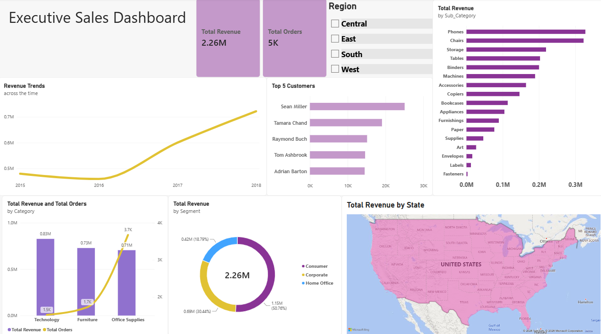

# Superstore Sales Data Analysis (SQL & Power BI)

## 🎯 Project Overview
This project presents an end-to-end data analysis pipeline using the US Superstore sales dataset. The primary objective is to transform raw, unformatted transaction records into a clean, structured data model and extract actionable business insights regarding regional performance, product demand, and customer purchasing behavior using **SQLite** and **Power BI**.

---

## 🛠️ Tech Stack & Skills Demonstrated

- **Database / Environment:** SQLite, Visual Studio Code
- **Data Cleaning (SQL):** Standardized date formats using string manipulation and normalized column headers via SQL Views.
- **Advanced SQL Techniques:** 
  - Common Table Expressions (CTEs) for multi-step aggregations.
  - Subqueries for dynamic baseline comparisons.
  - Complex aggregations (`GROUP BY`, `ORDER BY`, `COUNT`, `SUM`).
- **Data Modeling & BI (Power BI):**
  - Designed a **Star Schema** with a 1-to-many relationship between a dedicated `Calendar` dimension table and the `Store_Sales_Clean` fact table.
---

## 💡 Key Business Questions & Insights

1. **Customer Analytics:**
   - Identified top customer segments and high-value buyers through SQL CTEs and visual filtering.
   - Filtered top 5 VIP clients contributing disproportionately to revenue for retention targeting.

2. **Regional Revenue Contribution:**
   - Calculated exact income percentages per region. Sales are heavily anchored in major state economies.

3. **Product & Category Dynamics (Volume vs. Revenue Trade-Off):**
   - **Technology:** Drives the highest total revenue (~$0.83M) with lower transaction volume (~1.5K orders), representing a high Average Order Value.
   - **Office Supplies:** Generates high transactional volume (3.7K orders) at a lower total revenue ($0.71M), indicating high-frequency consumable purchases.
   - 
4. **Isolated Market Trends:**
   - Multi-filtered analysis isolating highest-spending customers and sub-category dynamics exclusively across regional markets.

---

## 📊 Power BI Dashboard Architecture

- **KPI Header:** Dynamic card visuals tracking core metrics (`Total Revenue`: $2.26M | `Total Orders`: 5K).
- **Executive Time-Series:** Continuous trend chart mapping yearly revenue progression from 2015 to 2018.
- **Geographic Cross-Filtering:** Interactive US Filled Map linked dynamically to state-level revenue.
- **Dual-Axis Category Analysis:** Combo chart mapping total orders against monetary yield per product line.

---

## 📁 Repository Structure

- `Store_Sales.sql` - Complete SQL script containing the data cleaning View, EDA queries, and business metric CTEs.
- `Store_Sales_Clean.csv` - Processed dataset exported from SQLite, ready for BI modeling.
- `Executive_Sales_Dashboard.pbix` - Interactive Power BI Dashboard file.
- `Executive_Sales_Dasboard_S.png` - High-resolution export of the Power BI executive layout.
- `README.md` - Full project documentation.

---
